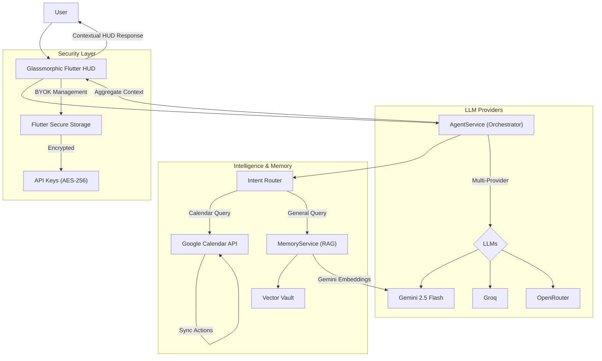
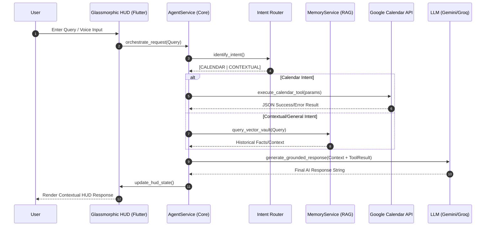

# Technical Architecture: Calendar AI Agent

This document outlines the architecture for the **Calendar AI Agent**, a professional, privacy-first mobile assistant.

## 🏗️ System Architecture

The following diagram illustrates the high-level components and their interactions, ranging from the Flutter HUD to the multi-provider LLM orchestration layer.

> [!NOTE]
> **Dynamic Design**: Visualized using the [ArchMind MCP Render](https://mermaid.ink/img/Z3JhcGggVEIKICBVc2VyWyJVc2VyIl0gLS0+IEZyb250ZW5kWyJHbGFzc21vcnBoaWMgRmx1dHRlciBIVUQiXTsKICBGcm9udGVuZCAtLT4gQWdlbnRTZXJ2aWNlWyJBZ2VudFNlcnZpY2UgKE9yY2hlc3RyYXRvcikiXTsKICBBZ2VudFNlcnZpY2UgLS0+IEludGVudFJvdXRlclsiSW50ZW50IFJvdXRlciJdOwogIEludGVudFJvdXRlciAtLSBDYWxlbmRhciBRdWVyeSAtLT4gR29vZ2xlQ2FsZW5kYXJBUElbIkdvb2dsZSBDYWxlbmRhciBBUEkiXTsKICBJbnRlbnRSb3V0ZXIgLS0gR2VuZXJhbCBRdWVyeSAtLT4gTWVtb3J5U2VydmljZVsiTWVtb3J5U2VydmljZSAoUkFHKSJdOwogIE1lbW9yeVNlcnZpY2UgLS0+IFZlY3RvclZhdWx0WyJWZWN0b3IgVmF1bHQiXTsKICBHb29nbGVDYWxlbmRhckFQSSAtLSBzY2hlZHVsZV9ldmVudF90b29sIC0tPiBHb29nbGVDYWxlbmRhckFQSTsKICBHb29nbGVDYWxlbmRhckFQSSAtLSBsaXN0X3VwY29taW5nX2V2ZW50c190b29sIC0tPiBHb29nbGVDYWxlbmRhckFQSTsKICBHb29nbGVDYWxlbmRhckFQSSAtLSBkZWxldGVfZXZlbnRfdG9vbCAtLT4gR29vZ2xlQ2FsZW5kYXJBUEk7CiAgQWdlbnRTZXJ2aWNlIC0tIEFnZ3JlZ2F0ZSBDb250ZXh0IC0tPiBGcm9udGVuZDsKICBGcm9udGVuZCAtLSBDb250ZXh0dWFsIEhVRCBSZXNwb25zZSAtLT4gVXNlcjsKICBBZ2VudFNlcnZpY2UgLS0gTExNIFByb3ZpZGVycyAtLT4gTExNX0dlbWluaVsiR2VtaW5pIDIuNSBGbGFzaCJdOwogIEFnZW50U2VydmljZSAtLSBMTE0gUHJvdmlkZXJzIC0tPiBMTE1fR3JvcVsiR3JvcSJdOwogIEFnZW50U2VydmljZSAtLSBMTE0gUHJvdmlkZXJzIC0tPiBMTE1fT3BlblJvdXRlclsiT3BlblJvdXRlciJdOwogIE1lbW9yeVNlcnZpY2UgLS0gR2VtaW5pIEVtYmVkZGluZ3MgLS0+IExMTV9HZW1pbmk7CiAgRnJvbnRlbmQgLS0gTWFuYWdlcyAtLT4gU2VjdXJlS2V5c3RvcmVbIlNlY3VyZSBLZXlzdG9yZSJdOwogIFNlY3VyZUtleXN0b3JlIC0tIFN0b3JlcyAtLT4gQllPS1siQllPSyAoR2VtaW5pL0dyb3EgS2V5cykiXTs=?theme=dark) link.

---

## 🔄 Sequence Flow: User Query Execution

This sequence diagram depicts the lifecycle of a user request, highlighting the internal "Intent Routing" and the autonomous interaction between the Agent Service and the Memory Engine.

## 🛠️ Key Component Breakdown

### 1. Frontend: Glassmorphic HUD
- **Stack**: Flutter CustomPainter & BackdropFilter.
- **Role**: Provides a professional, "localized command center" feel. Handles UI states for [Router Status], [Security Lock], and [OAuth Sync].

### 2. Agent Intelligence: AgentService
- **Orchestration**: Manages the handshake between user inputs and backend providers.
- **Multi-Provider**: Supports failsafe switching between Gemini (default), Groq (speed), and OpenRouter (model variety).

### 3. Passive Memory Engine: MemoryService
- **Background RAG**: Automatically processes previous interactions to extract key facts.
- **Vector Vault**: Localized vector storage using Gemini Embeddings for retrieval.

### 4. Integrations: Google Calendar
- **Sync**: Bi-directional event tracking.
- **OAuth 2.0**: Secure token management handled natively via `google_sign_in`.

### 5. Security: BYOK (Bring Your Own Key)
- **Privacy**: All keys are stored in the device's secure enclave (`flutter_secure_storage`).
- **Encryption**: Data never touches a centralized server, ensuring maximum user sovereignty.
